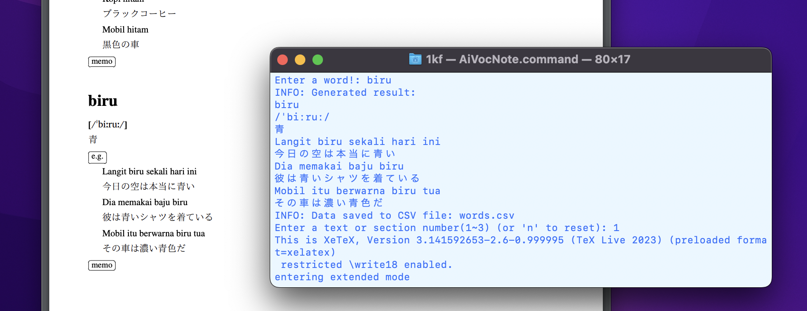

# README



## 概要
本プロジェクトは、語学学習者が知らない単語を効率的に検索・記録するためのツールです。  
語学学習において、知らない単語を調べ、それを復習することは重要です。しかしこの学習法には以下のような課題が存在します：

- 調べた単語を記録し、管理するのが面倒くさい。
- 学習者が少ない言語の場合、辞書サイトによっては単語がヒットしないことがある。

本プロジェクトではこれらの課題を解決するために、以下のツールを活用。

- **[Gemini](https://ai.google.dev/)**: 40を超える言語に対応。これを用い、辞書サイトでヒットしない問題を解決を図る。
- **LaTeX**: 単語一覧を整理し、PDFとして出力する。

## 特徴
- 任意の言語を対象に設定可能。
- 単語リストをPDF形式で出力。
- 保存先やPDF内のセクション名をカスタマイズ可能。

---

## 使用方法

1. 必要なツールをインストールしてください：
   ```bash
   pip install gemini
   ```

2. GEMINI_API_KEY環境変数を設定します：

   APIキーの取得: Gemini API からAPIキーを取得してください。
   環境変数の設定:
   Windowsの場合:
   ```bash
   set GEMINI_API_KEY=your_api_key_here
   ```
   macOS/Linuxの場合:
   ```bash
   export GEMINI_API_KEY=your_api_key_here
   ```
   your_api_key_here は、実際に取得したAPIキーに置き換えてください。

3. pythonファイル内の設定箇所を変更します。

   ```python
   #####################################################################
   # 言語を設定
   language = 'インドネシア語'

   # PDFの保存先を設定
   output_directory = os.getcwd()
   #####################################################################
   ```

   - `language`: 学習する言語を指定します。
   - `output_directory`: PDFファイルの保存先を指定します。

4. スクリプトを実行します。
   ```bash
   python AiVocNote.py
   ```


    スクリプト実行後、次のメッセージが表示されます：

    ```
    Enter a word!:
    ```
    ここで、調べたい単語, フレーズを入力してください。  
    Geminiにより生成された情報（発音、意味、例文など）と共に、次のようなメッセージが現れます。
    ```
    Enter a text or section number(1~3) (or 'n' to reset): 
    ```
    記録する場合は、セクション番号（1~3）を入力します。PDFファイル内のそのセクションに語彙データが追加され、PDFファイルが生成されます。        
    この時、メモを残すこともできます。


---

## LaTeXテンプレートの説明

以下のテンプレートを使用して、セクション名をカスタマイズできます。

```latex
\section*{section1}

%section1

\newpage

\section*{section2}

%section2

\newpage
```

- `\section*{}`: セクション名を指定します。
- `%section1`, `%section2`: 各セクションの内容を記述します。

---

## 注意事項

- Geminiを利用するため、インターネット接続が必要です。
- 出力されたPDFファイルを確認するために、LaTeX環境が事前にインストールされている必要があります。